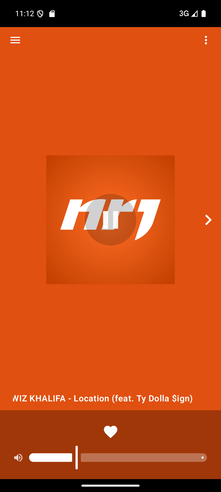
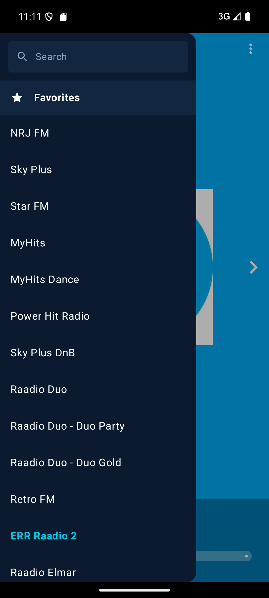
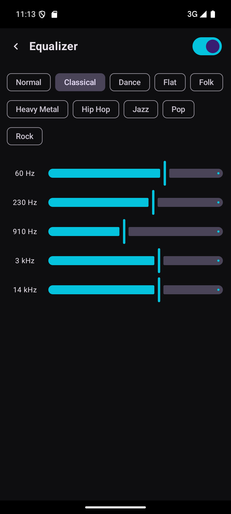
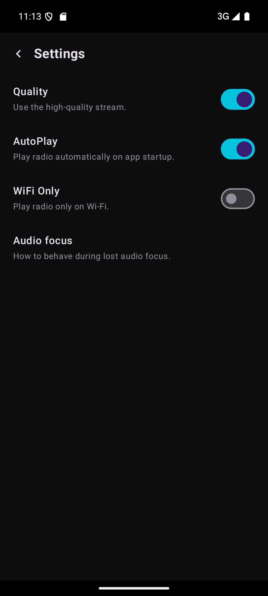

# Eeter

Eeter is an Android internet‑radio app for Estonian stations, built with Kotlin and Jetpack Compose. It's a clean‑room reimplementation of the original **eeRaadio** app: a full‑screen swipeable player, a browsable station list, an equalizer, and full **Android Auto** support.

> Personal project. Station names, logos and audio streams belong to their respective broadcasters (see [Disclaimer](#disclaimer)).

📥 **[Download the latest APK](https://github.com/oliver1264/Eeter/releases/latest)** — requires Android 8.0+ (you may need to allow installing from unknown sources).

## Screenshots

| Player | Stations | Equalizer | Settings |
|:---:|:---:|:---:|:---:|
|  |  |  |  |

## Features

- **91 Estonian radio stations**, each with its own logo.
- **Swipeable player** — a full‑screen `HorizontalPager` showing the station logo on a brand‑colored background (extracted from the logo via the AndroidX Palette library). Left/right arrows and swipes step through stations; switching auto‑plays the newly shown station.
- **Favorites** — a curated favorites list with reorder‑aware navigation. Picking a station from the **All** section browses the whole station list; picking from **Favorites** browses favorites. The on‑screen arrows and the media‑notification / Android Auto previous‑next buttons stay in sync.
- **Now playing** — current "Artist – Title" is shown under the logo and in the media metadata:
  - Most Shoutcast/Icecast stations report it via **ICY `StreamTitle`** metadata.
  - Two stations with no usable stream metadata (Power Hit Radio, Sky Plus DnB) are polled from their broadcaster web APIs (`NowPlay`).
  - Artist‑first ordering everywhere (main window, media output panel, Android Auto).
- **Android Auto** — browse Favorites / All, play, and skip stations from the car head unit (`MediaLibraryService`).
- **Equalizer** — full‑screen equalizer with presets and per‑band frequency sliders, backed by the platform `Equalizer`.
- **Settings** — stream quality (high/low), autoplay last station on launch, Wi‑Fi‑only playback, and an audio‑focus policy (continue / pause / restart on focus regain).
- **HLS + Icecast/Shoutcast** streaming via Media3 ExoPlayer.
- Persists favorites and preferences with **DataStore**; loads logos with **Coil**.

## Tech stack

- **Language:** Kotlin (JVM 17)
- **UI:** Jetpack Compose (Material 3), Compose BOM
- **Playback:** AndroidX **Media3** — ExoPlayer, Session, HLS
- **Async:** Kotlin Coroutines
- **Persistence:** Jetpack DataStore (Preferences)
- **Images:** Coil; **AndroidX Palette** for brand colors
- **Min SDK:** 26 · **Target/Compile SDK:** 34

## Project structure

```
app/src/main/java/com/eeter/
├── EeterApp.kt                 # Application entry point
├── ui/
│   ├── MainActivity.kt         # Compose UI: player pager, drawer, equalizer, settings
│   ├── Theme.kt                # Material 3 theme
│   └── EqualizerController.kt  # Wrapper around the platform Equalizer
├── playback/
│   ├── PlaybackService.kt      # MediaLibraryService + ExoPlayer; Android Auto browse tree
│   ├── MediaItems.kt           # Builds MediaItems / browse nodes from stations
│   └── NowPlay.kt              # Web "now playing" poller for 3 metadata-less stations
└── data/
    ├── Stations.kt             # The station list (id, name, stream URLs, logo, now-playing kind)
    ├── Favorites.kt            # Favorites persistence (DataStore)
    └── Settings.kt             # App preferences (DataStore)
```

### How playback works

`MainActivity` connects to `PlaybackService` (a Media3 `MediaLibraryService`) through a `MediaController`. Selecting a station builds a queue — the full station list when browsing **All**, otherwise favorites — so previous/next controls work everywhere. The service exposes a browse tree (Favorites / All) to Android Auto and resolves tapped stations into playable streams. ICY metadata and the `NowPlay` web poller feed the current song into `MediaMetadata`, which the player UI, the media‑output panel, and Android Auto all render.

## Building

Requirements: Android Studio (recent), JDK 17, Android SDK 34.

```bash
# Debug build
./gradlew assembleDebug          # use gradlew.bat on Windows

# Install on a connected device/emulator
./gradlew installDebug
```

The debug APK is written to `app/build/outputs/apk/debug/app-debug.apk`.

## Releasing

Releases are built and published automatically by GitHub Actions
([`.github/workflows/release.yml`](.github/workflows/release.yml)) whenever a
version tag is pushed:

1. Bump `versionCode` / `versionName` in `app/build.gradle.kts`.
2. Commit, then tag and push:
   ```bash
   git tag v2.8
   git push origin v2.8
   ```

The workflow builds a **signed** release APK and attaches it to a new GitHub
Release. Signing uses a keystore stored as encrypted repository secrets
(`KEYSTORE_BASE64`, `KEYSTORE_PASSWORD`, `KEY_ALIAS`, `KEY_PASSWORD`).

For a local signed build, keep `eeter-release.jks` and `keystore.properties`
(both gitignored) in the project root and run `./gradlew assembleRelease`.

## License

Released under the [MIT License](LICENSE). Note that the license covers the
application source code only — station names, logos, and audio streams belong to
their respective broadcasters (see below).

## Disclaimer

This is an unofficial, non‑commercial client. It does not host or rebroadcast any audio — it only plays the public stream URLs published by each broadcaster. All station names, logos, and trademarks are the property of their respective owners. Stream availability depends entirely on the broadcasters.
